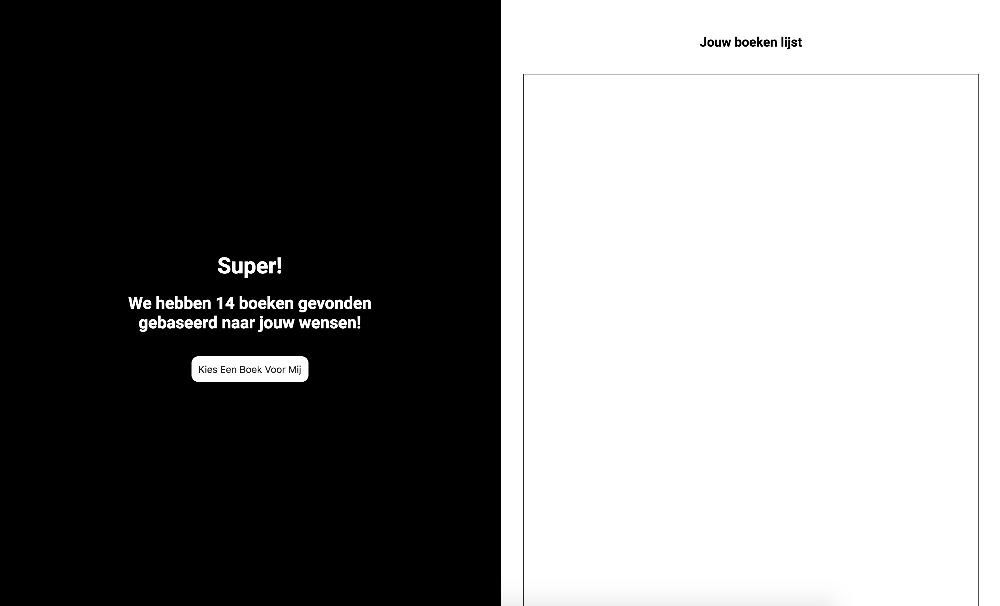
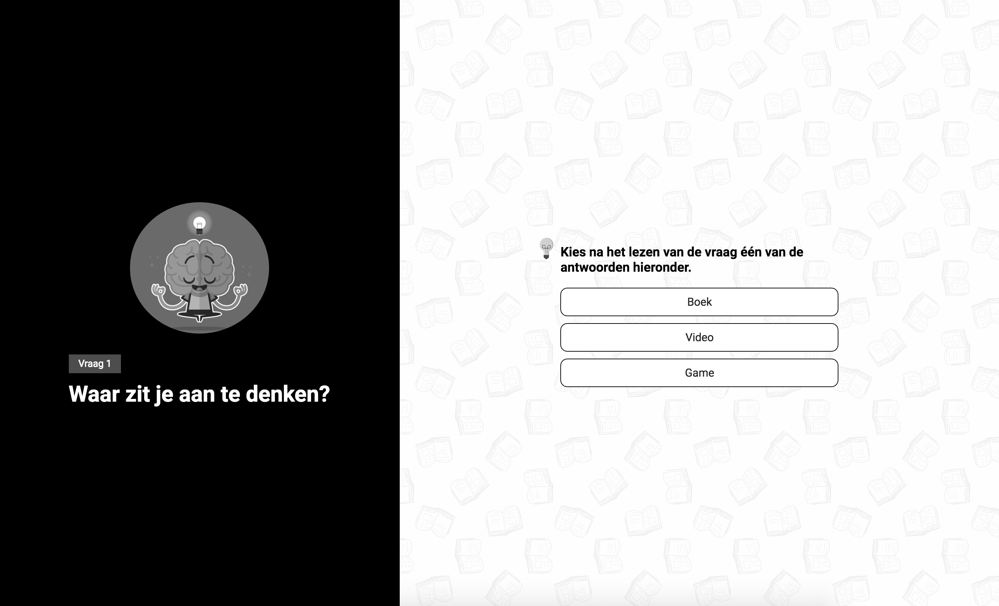

# Browser Technologies - Week 1
//Progressive Enhancement

## Assignment 1A
### feature research

We had to do research to two features that websites use, remove them, to see how the websites will work after removing them.

I did the research on cookies and custom fonts.

#### Cookies
Since the new privacy law, cookies are a must have on most of the websites that store data from their users. The user has to have the ability to accept or decline the cookies used by the website. But how do those website's work if you just turn the cookies off?

###### Dorhoutmees.nl
Is the website of my old workplace. I never actually looked at the website before so it was nice to give it a test.

Things that stand out:
The cookie-bar that was installed on the website didn't have a decline option. The only option was an "oke" button so you would automatically accept.

After turning off the cookies the online chat was no longer there. The rest of the website was still working correctly and you could still navigate through the pages. After checking the cookies again I saw that still after reloading the website there were still new cookies installed. These were from an external web analytics website.

Solution:
Actually give the user the possibility to decline the cookies and then actually don't still force the cookies to the user.  

###### Bol.com
One of the biggest webshop's in the netherlands with a lot of products.

Things that stand out:
The things that stood out the most was that, after turning off the cookies, a big message appeared at the top of the page. The message tells the user that you can browse through the products but can't add or buy them because then the cookies are needed. I think that is kind of strange because what information is that important that a user MUST have them turned on. The only data I can think of is the products that you put in your basket.

Solution:
Maybe add the products that the user wants to the local storage so it is still possible to buy stuff without accepting the cookies.

## Assignment 1B - Fork the OBA
I cloned the oba project to this weeks folder and started to look at the 8 features from Assignment 1A. We had to take a look at our project and see what we can improve our progressive enchancement.

##### Turning off images
After turning the images off i found out that the application is still usable. The only problem was that the booklist, which showed images of the books only, was no longer visible. I also found out that I mostly forget to insert something in the alt tag. Because of this if a blind person would use the website with a screenreader he would get no explanation at all, which is especially bad in the book list.

Fix:
To solve the problem it would be better to fill in the alt tags and to include the title under the books in the book list.

##### Turn off Custom fonts
Nothing really happened when I turned the custom fonts off. Some of the parts shifted a bit on the screen but not in a big screw-up way.

##### Checking for color blindness
I found out that the contrast is actually not that bad in the application. I think this is because of the limited colors I used which were mostly black white and red. After checking it with all of the possible types of color blindness the contrast stayed the same. Something that could get fixed is that the action buttons are the same as the answer buttons. We could fix this by changing the shape of the buttons.

##### Muis/Trackpad not working
This a feature I did'nt think about making the application. I used a button tag for the action buttons which could get reached by using "tab" which was good but sadly I used list items as the answers which did not have a tab index. So it's impossible to "tab" through the application if you don't have a mouse or trackpad.

Fix: To fix this I will have to generate the answers with a tags or button tags. This way it would be possible to use the tab button to go through the application.

##### Turning off Javascript
This feature would be really hard to change if the application stayed Clientside rendered. After turning javascript off the whole application would stop working after the first question. This is because the whole application is build around an Api which does a "get" request after the first question.

Fix: To fix this the application would need to be rebuild but this time server side rendered. This way I can let the server do the get request and not the client itself.

##### Cookies and local storage
I combined these two features together because after turning the cookies off the localstorage would also not work anymore.

I only used the local storage to store the data from the api. The moment I turn the localstorage off it's no longer possible to manipulate the data after the first question. This automatically makes the application unusable.

fix: I think it would be better to store the data not only in the localstorage but also in a global variable. This way if the localstorage is turned off we can still use the data gathered from the api.  

### Opdracht 1B - Fork je OBA
Hoe zit het eigenlijk met Progressive Enhancement van je OBA opdracht? Waarschijnlijk kan daar wel het één en ander aan verbeterd worden, dat ding is immers in een week in elkaar gehackt!

Voor deze opdracht ga je toepassen wat je van opdracht 1.1 hebt geleerd.
- Pas Progressive enhancement toe op je OBA Web App.
- Check je OBA Web App op de 8 features uit opdracht 1.1 en verbeter de code waar mogelijk.
- Test je OBAapp in het Device Lab.
- Laat je OBAapp voorlezen door een screenreader.
- Gebruik onderstaande artikelen om je code te optimaliseren.

[The accessibility mindset](https://24ways.org/2015/the-accessibility-mindset/)  

[Accessibility Originates With UX: A BBC iPlayer Case Study](https://www.smashingmagazine.com/2015/02/bbc-iplayer-accessibility-case-study/)

Beoordelingscriteria
- Zet je code op Github
- Schrijf een Readme met:
  - een beschrijving van de problemen die je hebt gevonden
  - beschrijf hoe je de problemen hebt opgelost
  - of hoe je dit zou oplossen (met todo’s) als je genoeg tijd en budget zou hebben

## Assignment 1A
